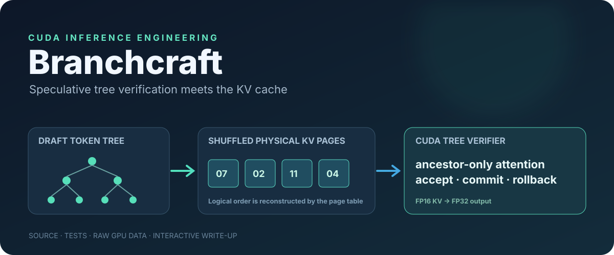
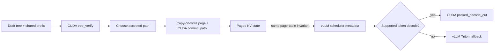
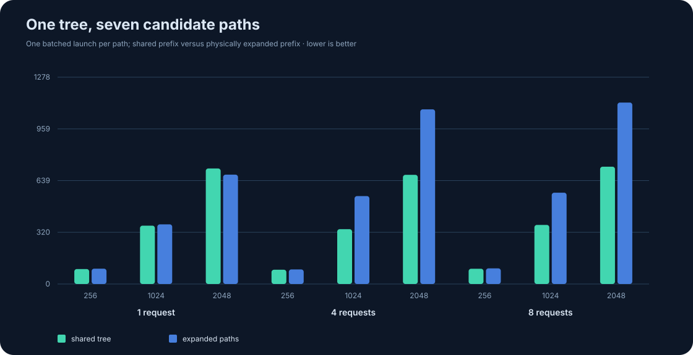
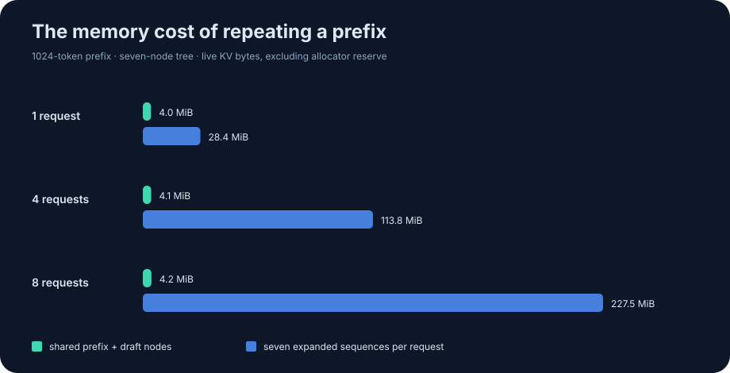

# Branchcraft · CUDA attention across the KV-cache boundary

<p align="center"></p>

**A small inference systems lab with real framework entry points.** Branchcraft verifies a speculative draft tree against a shared paged prefix, commits only the accepted path through a copy-on-write KV transaction, exposes the CUDA kernels as PyTorch operators, and plugs a packed-KV decode path into vLLM V1.

[](https://github.com/Haaziq386/branchcraft-cuda/actions/workflows/build.yml) · [Interactive tree article](https://haaziq386.github.io/branchcraft-cuda/docs/) · [Visual framework article](https://haaziq386.github.io/branchcraft-cuda/docs/framework.html) · [Integration contract](docs/framework-integration.md)

## Why this project exists

A speculative candidate may attend to the prompt and **its own ancestors**, never a sibling. Multiple requests can share physical prefix pages; writing an accepted path into a shared partial page corrupts the other request. A serving backend adds another constraint: the scheduler owns the page table and may store logically identical K/V under different physical strides.

Branchcraft makes these contracts visible and testable across three layers:

| Layer | What is implemented | Where to start |
| --- | --- | --- |
| CUDA | Ancestor-only online-softmax verifier, accepted-path copy, paged GQA decode, direct packed-KV decode | [`src/tree_attention.cu`](src/tree_attention.cu), [`src/packed_decode.cu`](src/packed_decode.cu) |
| PyTorch | Dispatcher schemas, CUDA implementations, FakeTensor support, `torch.compile` tracing, CUDA graph-safe output, copy-on-write page transaction | [`bindings/torch_ops.cpp`](bindings/torch_ops.cpp), [`python/branchcraft_torch/transaction.py`](python/branchcraft_torch/transaction.py) |
| vLLM V1 | Installed `CUSTOM` attention backend: guarded one-token FP16 decode from vLLM's packed cache, inherited Triton fallback for other calls | [`python/branchcraft_vllm/backend.py`](python/branchcraft_vllm/backend.py) |



**Boundary:** the vLLM attention backend performs ordinary token decode. It does not receive draft-tree metadata and does not replace vLLM's speculative acceptance algorithm. The PyTorch path exposes tree verification and transaction semantics separately. This distinction is part of the design, not a hidden claim of full speculative serving integration.

## Reproduce the CUDA work

Requirements: NVIDIA GPU, matching CUDA toolkit with `nvcc`, C++17, `make`. The standalone binary has no Python dependency.

```bash
make CUDA_ARCH=sm_120                 # set the SM target for your GPU
./build/branchcraft test             # CPU oracle and cache invariants
./build/branchcraft tree-bench --output benchmarks/tree_results.csv
./build/branchcraft bench --output benchmarks/decode_results.csv
python3 scripts/make_charts.py benchmarks/decode_results.csv
```

For the framework path, install PyTorch and vLLM for your CUDA platform in a Python 3.12 environment, then build the extension against that same environment:

```bash
pip install vllm==0.27.0 pytest
CUDA_HOME=/path/to/cuda TORCH_CUDA_ARCH_LIST=12.0 \
  pip install -e . --no-build-isolation --no-deps
pytest -q tests/test_torch_ops.py tests/test_transaction.py tests/test_vllm_backend.py
python examples/vllm_parity.py --output benchmarks/vllm_parity.json
```

The parity script launches stock vLLM Triton and Branchcraft `CUSTOM` in separate processes, compares exact greedy token IDs, and requires trace markers for both the custom decode and Triton prefill fallback. The [checked-in model parity artifact](benchmarks/vllm_parity.json) records three prompts, both sets of token IDs, the model revision, and framework versions. See the [environment, backend guard, and source map](docs/framework-integration.md). `BRANCHCRAFT_TRACE=1` enables the route markers.

## What the CUDA verifier measures

Seven candidate nodes per request, 32 query heads, 8 KV heads, D=128, FP16 KV, page size 16, RTX PRO 5000 Blackwell. Both compared paths use one batched GPU launch. The expanded baseline physically duplicates each candidate's prefix and runs this repository's paged decode kernel. The ratio is `expanded / tree`; below 1 means the tree path is slower.

| Requests | Prefix tokens | Tree latency | Expanded latency | Ratio | Live KV saved |
| ---: | ---: | ---: | ---: | ---: | ---: |
| 1 | 2,048 | 714.1 µs | 675.9 µs | 0.95× | 85.8% |
| 4 | 1,024 | 338.9 µs | 543.4 µs | 1.60× | 96.4% |
| 8 | 2,048 | 725.2 µs | 1,121.4 µs | 1.55× | 98.2% |



The memory metric counts live KV representation, excluding reserve capacity and allocator metadata. These are **within-project** measurements, not speedups against vLLM or vendor attention kernels. The single-request long-prefix regression is a real limitation. See [raw CSV](benchmarks/tree_results.csv) and the [benchmark protocol](benchmarks/README.md).



The ordinary decode kernel also has split-KV execution and an FP32 merge of partial softmax states. Its [dispatch sweep](assets/phase-map.svg) studies low-batch, long-context parallelism; it is not used by the vLLM packed-cache fast path.

## Correctness gates

- The standalone CUDA suite compares outputs with an independent CPU oracle and checks empty/partial pages, ragged batches, two head dimensions, split-KV, tree masks, accepted-path replay, sibling isolation, and rollback.
- The PyTorch tests compare tree and packed-cache outputs with independent tensor references; they exercise HND and NHD strides, dispatcher schema/FakeTensor behavior, compilation tracing, CUDA graph replay, and in-place commit.
- The transaction test forks a request, commits into a shared partial page, checks the sibling bytes, then rolls back the request to the original mapping and bytes.
- The model script checks that a real vLLM generation enters the custom CUDA decode path and emits the same greedy token IDs as stock Triton.

## Scope and prior work

Tree attention and paged KV are established ideas. [SpecInfer](https://arxiv.org/abs/2305.09781), [DeFT](https://arxiv.org/abs/2404.00242), [PagedAttention](https://arxiv.org/abs/2309.06180), and [FlashInfer](https://arxiv.org/abs/2501.01005) inform this project. Branchcraft contributes a compact implementation of the **tree verification ↔ page transaction ↔ framework operator** boundary and a separate vLLM V1 decode backend that reads its packed cache directly.

The tree kernel is one warp per output head; it does not use tensor cores or production-scale prefix partitioning. The Python page owner is an inspectable test and example, not a concurrent allocator. The vLLM fast path covers causal FP16 one-token decode with page size 16 and D=64/128; other cases use vLLM's inherited Triton implementation. vLLM internal metadata is version-sensitive, so the integration pins `vllm==0.27.0`.

MIT licensed. See [LICENSE](LICENSE) and [CONTRIBUTING.md](CONTRIBUTING.md).
