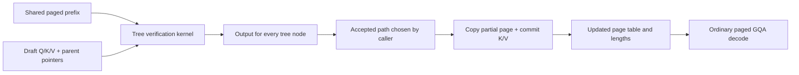

# Branchcraft · speculative-tree attention in CUDA

<p align="center"></p>

**A CUDA inference lab for the moment a draft tree meets the KV cache.** Branchcraft verifies every candidate node of a speculative tree in one GPU launch. Each node attends to a **shared paged prefix plus only its ancestors**. An accepted root-to-leaf path can then be copied into a fresh KV page, preserving sibling branches; rollback restores the prior page-table metadata.

[Read the illustrated engineering article](https://haaziq386.github.io/branchcraft-cuda/) · [Tree kernel](src/tree_attention.cu) · [Raw tree results](benchmarks/tree_results.csv)


## Why this is an inference-systems project

The hard part is the contract between a scheduler's tree, the attention kernel, and a mutable KV cache. A normal sequence mask allows all earlier positions. A speculative **tree mask** allows exactly the prefix and the ancestors of one candidate; sibling tokens must stay invisible. After verification, only the accepted path should enter the durable cache. If several requests share the final prefix page, writing directly into that page corrupts the others. Branchcraft makes these invariants executable and tests them against a separate CPU oracle.

This project combines established ideas from [SpecInfer](https://arxiv.org/abs/2305.09781), [DeFT](https://arxiv.org/abs/2404.00242), [PagedAttention](https://arxiv.org/abs/2309.06180), and [FlashInfer](https://arxiv.org/abs/2501.01005). It is an original, compact implementation and benchmark of a particular **tree-verification + shared-page transaction** boundary; it does not claim to invent tree attention or production speculative decoding.

## Measured on RTX PRO 5000 Blackwell

Seven candidate nodes per request, 32 query heads, 8 KV heads, D=128, FP16 KV, page size 16. Both paths use one batched GPU launch and produce the same attention outputs. The expanded baseline physically duplicates each candidate's prefix and runs the project's paged decode kernel. `ratio = expanded_us / tree_us`, so below 1 means the tree path is slower.

| Requests | Prefix | Tree latency | Expanded latency | Ratio | Live KV saved |
| ---: | ---: | ---: | ---: | ---: | ---: |
| 1 | 2,048 | 714.1 µs | 675.9 µs | 0.95× | 85.8% |
| 4 | 1,024 | 338.9 µs | 543.4 µs | 1.60× | 96.4% |
| 8 | 2,048 | 725.2 µs | 1,121.4 µs | 1.55× | 98.2% |

Numbers are CUDA-event medians from [the complete CSV](benchmarks/tree_results.csv). The memory metric counts live KV representation; it excludes fixture reserve capacity and allocator metadata. This is a comparison to an intentionally expanded representation, **not a vendor-kernel speedup claim**. The single-request long-prefix regression matters: the parent walk and shared layout do not automatically make the kernel faster.


## Run it

Requirements: NVIDIA GPU, CUDA Toolkit supporting your GPU (`12.8+` for Blackwell), C++17, `make`, Python 3 for SVG generation. No PyTorch dependency.

```bash
make CUDA_ARCH=sm_120
./build/branchcraft test
./build/branchcraft tree-bench --output benchmarks/tree_results.csv
./build/branchcraft bench --output benchmarks/decode_results.csv
python3 scripts/make_charts.py benchmarks/decode_results.csv
```

For Ampere or Ada, use a matching architecture such as `sm_80` or `sm_89`. `--quick` shortens either benchmark. On the rented Blackwell host, CUDA headers/compiler were provided by `nvidia/cuda:12.8.1-devel-ubuntu22.04`; the compiled binary ran directly on the host's NVIDIA driver. The command sequence was:

```bash
docker run --rm -v "$PWD:/work" -w /work nvidia/cuda:12.8.1-devel-ubuntu22.04 make CUDA_ARCH=sm_120
./build/branchcraft test
./build/branchcraft tree-bench
./build/branchcraft bench
python3 scripts/make_charts.py benchmarks/decode_results.csv
```

## Kernel and cache model



The verifier maps one warp to one `(request, node, query head)`. It reads FP16 K/V, accumulates QK and softmax state in FP32, and walks parent indices from the node to the root. The prefix is stored once in a shuffled physical page pool. Draft nodes are stored once each. A separate paged GQA decode kernel supports a single-partition or split-KV path; its [dispatch sweep](assets/phase-map.svg) is a secondary study of low-batch parallelism.

The test suite checks empty prefixes, partial pages, two head dimensions, ragged ordinary decode, 1–16 KV splits, tree ancestor masking, accepted-path equality, sibling isolation, and metadata rollback. See [benchmark protocol](benchmarks/README.md) for exact timing and memory definitions.

## Scope and limitations

Branchcraft covers the **attention and KV-cache boundary**, not a full model forward pass. It has no draft model, token sampler, acceptance algorithm, prefill, continuous scheduler, or framework integration. The host test demonstrates a single transaction and reserves physical pages up front; it is not a concurrent production allocator. The tree kernel is a legible one-warp-per-head implementation and does not use tensor cores or the advanced partitioning of DeFT or FlashInfer. CPU-side metadata validation is required before passing parent pointers and page IDs to the CUDA kernels.

## Repository map

| Path | What to inspect |
| --- | --- |
| [`src/tree_attention.cu`](src/tree_attention.cu) | Ancestor-only online softmax and accepted-path copy |
| [`src/paged_gqa.cu`](src/paged_gqa.cu) | Paged GQA decode, split-KV, stable merge |
| [`src/main.cu`](src/main.cu) | Independent CPU oracles, shared-page transaction test, benchmarks |
| [`include/branchcraft.hpp`](include/branchcraft.hpp) | Device-pointer contracts and supported shapes |
| [`benchmarks/tree_results.csv`](benchmarks/tree_results.csv) | Raw tree versus expanded-cache measurements |
| [`benchmarks/decode_results.csv`](benchmarks/decode_results.csv) | Split-KV dispatch sweep |
| [`scripts/make_charts.py`](scripts/make_charts.py) | Rebuilds every chart from raw CSV with Python standard library |
| [`docs/index.html`](docs/index.html) | Illustrated, interactive engineering article |

MIT licensed. See [LICENSE](LICENSE).
