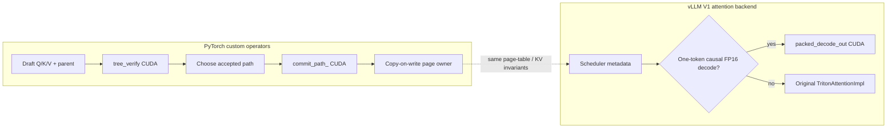

# From a CUDA kernel to a serving backend

Branchcraft has two framework entry points, both backed by source code in this
repository. They share the same rule: a logical token position resolves through
a page table to physical FP16 K/V. The tree verifier adds parent pointers and
an accepted-path transaction. The vLLM backend handles ordinary one-token
decode against vLLM's packed KV layout. The two entry points are separate
because vLLM's speculative decoding scheduler does not pass a draft tree to a
normal attention backend.

## What is actually integrated

| Layer | Implementation | Evidence |
| --- | --- | --- |
| PyTorch dispatcher | `TORCH_LIBRARY` and CUDA implementations for `tree_verify`, `packed_decode_out`, and `commit_path_` | `tests/test_torch_ops.py`: independent PyTorch oracle, fake tensors, `torch.compile`, CUDA graph replay, accepted-path copy |
| KV transaction | Python page owner and refcount bookkeeping; CUDA accepted-path copy | `tests/test_transaction.py`: fork, copy-on-write partial page, sibling isolation, rollback of mapping and bytes |
| vLLM V1 | Installed `vllm.general_plugins` entry point registers `CUSTOM`; a `TritonAttentionImpl` subclass replaces supported token decode with `packed_decode_out` | `examples/vllm_parity.py`: separate stock and custom model runs, exact greedy token comparison, fast-path marker; `benchmarks/vllm_parity.json` records one run |

The vLLM integration does **not** install the tree verifier into vLLM's
speculative acceptance loop. It replaces an attention-backend decode path.
That is a real vLLM extension point, but it has different semantics from
speculative tree verification.

## Install and reproduce

The framework integration is tested with Python 3.12, PyTorch 2.13, vLLM
0.27.0, CUDA 13.0 compiler components, and an NVIDIA RTX PRO 5000 Blackwell.
A local CUDA toolkit with
`nvcc` and a compiler that supports the GPU are required to build the extension.
Install PyTorch/vLLM for your CUDA platform first, then build in that same
environment:

```bash
python -m venv .venv
. .venv/bin/activate
pip install vllm==0.27.0 pytest
CUDA_HOME=/path/to/cuda TORCH_CUDA_ARCH_LIST=12.0 \
  pip install -e . --no-build-isolation --no-deps
pytest -q tests/test_torch_ops.py tests/test_transaction.py tests/test_vllm_backend.py
python examples/vllm_parity.py --output benchmarks/vllm_parity.json
```

Use your GPU's compute capability for `TORCH_CUDA_ARCH_LIST`. The parity script
downloads the pinned Qwen3-0.6B revision if needed, runs stock `TRITON_ATTN` and `CUSTOM` in
fresh processes, and fails if any greedy token differs or if either the
custom decode kernel or prefill fallback is unobserved.
`BRANCHCRAFT_TRACE=1` prints the first entry into each route.
The script selects vLLM's Torch sampler for greedy decoding to avoid an
unrelated FlashInfer sampling JIT on the test host.

If the Python CUDA toolkit is used instead of a system toolkit, align its
`nvidia-cuda-nvcc`, `nvidia-cuda-crt`, `nvidia-cuda-cccl`, and `nvidia-nvvm`
packages to the same CUDA minor version. The rented test host initially had
13.4 compiler components mixed with 13.0 headers/runtime, which broke JIT
compilation before model generation. Its driver also needed a matching
userspace library; ordinary driver installations should not require that
host-specific adjustment.

For direct vLLM usage, install the package and select
`attention_backend="CUSTOM"` in `vllm.LLM`. The plugin entry point registers
the backend during vLLM startup; it does not globally override the default.

## The boundary in one picture



The custom vLLM path reads the **logical** cache shape
`[physical pages, KV heads, 16 slots, 2 × head dim]`. Runtime strides handle
both HND and NHD physical layouts without copying KV. It uses one warp per
query head, streaming keys through an online FP32 softmax and writing FP16
output into vLLM's preallocated tensor. Cache updates remain vLLM's job.

The fast path requires FP16 query/output/cache, head dimension 64 or 128,
page size 16, one causal query per request, an ordinary decoder layer, and no
window, ALiBi, sinks, logits cap, KV quantization, or output quantization.
Other calls use the inherited Triton implementation. This guard keeps prefill
and specialized attention behavior with vLLM's existing code. A future
extension could split long KV histories across CTAs and merge softmax states;
the current packed kernel uses one warp per head and is not presented as a
general performance replacement for vLLM's attention kernels.

## Why these interfaces matter

`tree_verify` has a dispatcher schema and fake implementation, so `torch.compile`
can trace its output shape while preserving the opaque CUDA call. The
`packed_decode_out` schema marks its output as mutable, allowing callers to
reuse static addresses during CUDA graph replay. `commit_path_` declares both
cache tensors mutable. The extension launches on PyTorch's **current CUDA
stream**, so it composes with surrounding PyTorch work without a hidden
default-stream race.

The page transaction takes a snapshot by holding page references. A commit
into a partial final page sees a refcount above one, allocates a new physical
page, copies the existing prefix bytes, and writes accepted nodes there.
Rollback releases the new mapping and transfers snapshot references back to
the request. This also protects a forked sibling; the test asserts both its
page mapping and bytes remain unchanged.

## Source map

| File | Read it for |
| --- | --- |
| [`bindings/torch_ops.cpp`](../bindings/torch_ops.cpp) | Tensor validation, dispatcher registration, stream handoff |
| [`src/packed_decode.cu`](../src/packed_decode.cu) | Packed KV stride math and online softmax |
| [`python/branchcraft_torch/transaction.py`](../python/branchcraft_torch/transaction.py) | Refcounts, snapshot ownership, copy-on-write commit |
| [`python/branchcraft_vllm/backend.py`](../python/branchcraft_vllm/backend.py) | Fast-path guard and Triton fallback |
| [`examples/vllm_parity.py`](../examples/vllm_parity.py) | Reproducible model-level parity command |

Version note: this integration targets vLLM V1 `0.27.0` and uses its public
plugin registry plus a subclass of its Triton attention backend. vLLM's
internal attention metadata can change across releases, so the exact vLLM
version is pinned for reproduction.
